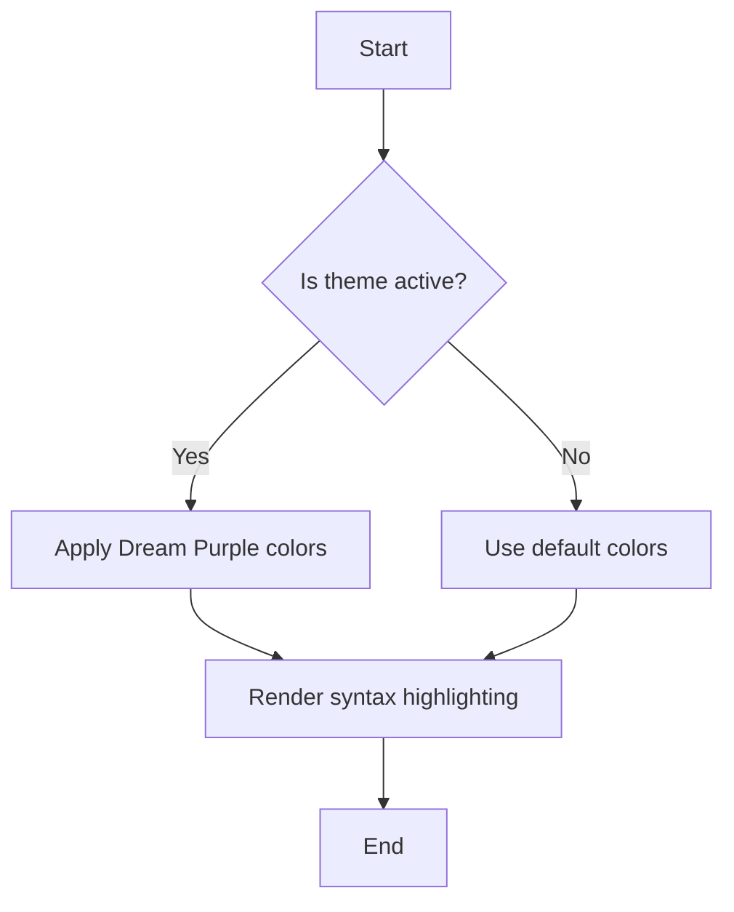
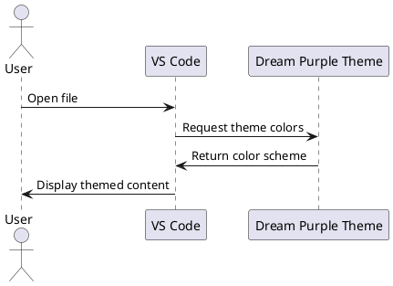

# Markdown Semantic Highlighting Test

This file tests **Dream Purple** theme's markdown syntax highlighting capabilities.

## Headers and Text Formatting

### Level 3 Header
#### Level 4 Header
##### Level 5 Header
###### Level 6 Header

**Bold text** and *italic text* and ***bold italic text***

~~Strikethrough text~~

`Inline code` with backticks

## Lists

### Unordered Lists
- First item
- Second item
  - Nested item
  - Another nested item
    - Deep nested item
- Third item

### Ordered Lists
1. First numbered item
2. Second numbered item
   1. Nested numbered item
   2. Another nested numbered item
3. Third numbered item

### Task Lists
- [x] Completed task
- [ ] Incomplete task
- [x] Another completed task

## Code Blocks

### JavaScript Code Block
```javascript
function greetUser(name) {
    console.log(`Hello, ${name}!`);
    return `Welcome, ${name}`;
}

const user = "Dream Purple User";
greetUser(user);
```

### Python Code Block
```python
def calculate_fibonacci(n):
    """Calculate Fibonacci sequence up to n terms"""
    if n <= 0:
        return []
    elif n == 1:
        return [0]
    elif n == 2:
        return [0, 1]
    
    fib = [0, 1]
    for i in range(2, n):
        fib.append(fib[i-1] + fib[i-2])
    
    return fib

# Generate first 10 Fibonacci numbers
result = calculate_fibonacci(10)
print(f"Fibonacci sequence: {result}")
```

### CSS Code Block
```css
.dream-purple-theme {
    --primary-color: #ff6b35;
    --secondary-color: #c792ea;
    background-color: var(--primary-color);
    color: var(--secondary-color);
    transition: all 0.3s ease;
}

.dream-purple-theme:hover {
    transform: translateY(-2px);
    box-shadow: 0 4px 12px rgba(255, 107, 53, 0.3);
}
```

## Links and Images

[Dream Purple Theme Repository](https://github.com/dreampurple/vscode-theme)

[Reference link with title](https://example.com "Example Website")


## Tables

| Feature | Status | Priority |
|---------|--------|----------|
| Syntax Highlighting | ✅ Complete | High |
| UI Theming | ✅ Complete | High |
| Semantic Tokens | ✅ Complete | Medium |
| Icon Theming | ❌ Not Planned | Low |

## Blockquotes

> This is a blockquote demonstrating the Dream Purple theme's
> ability to highlight quoted text with appropriate colors.
> 
> > Nested blockquotes are also supported
> > with proper indentation and styling.

## Horizontal Rules

---

## HTML in Markdown

<div style="background: linear-gradient(45deg, #ff6b35, #c792ea); padding: 1rem; border-radius: 8px;">
    <h3 style="color: white; margin: 0;">HTML Block in Markdown</h3>
    <p style="color: white; margin: 0.5rem 0 0 0;">This demonstrates HTML syntax highlighting within markdown.</p>
</div>

## Mathematical Expressions

Inline math: $E = mc^2$

Block math:
$$
\sum_{i=1}^{n} i = \frac{n(n+1)}{2}
$$

## Footnotes

Here's a sentence with a footnote[^1].

[^1]: This is the footnote content.

## Definition Lists

Term 1
: Definition for term 1

Term 2
: Definition for term 2
: Another definition for term 2

## Abbreviations

*[HTML]: Hyper Text Markup Language
*[CSS]: Cascading Style Sheets
*[JS]: JavaScript

The HTML and CSS are fundamental web technologies, while JS adds interactivity.

## Emoji and Unicode

🎨 Theme colors: 💜 Purple and 🧡 Orange
✨ Semantic highlighting ✨
🚀 Performance optimized 🚀

## Escape Characters

\*This text is not italic\*
\`This is not code\`
\# This is not a header

## Raw HTML Tags

<kbd>Ctrl</kbd> + <kbd>Shift</kbd> + <kbd>P</kbd>

<mark>Highlighted text</mark>

<details>
<summary>Click to expand</summary>

This content is hidden by default and can be expanded.

</details>

## YAML Front Matter

```yaml
---
title: "Dream Purple Theme Test"
author: "Theme Developer"
date: 2024-01-01
tags: ["vscode", "theme", "purple", "semantic-highlighting"]
categories: ["Development", "Tools"]
---
```

## Advanced Markdown Features

### Mermaid Diagrams



### PlantUML Diagrams



---

*This markdown file tests various syntax highlighting features of the Dream Purple theme.*